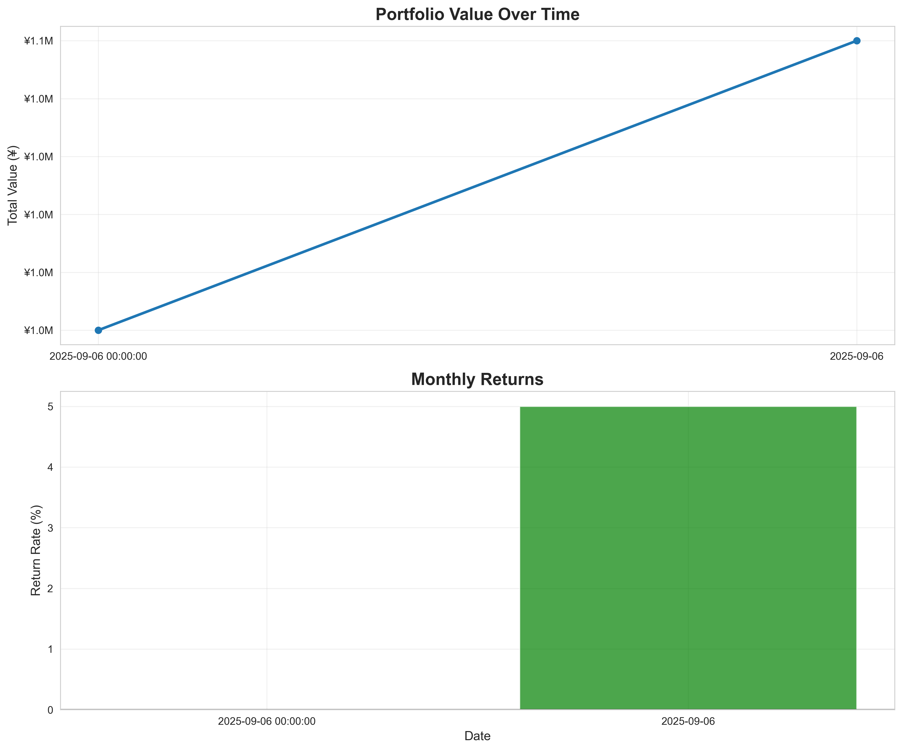
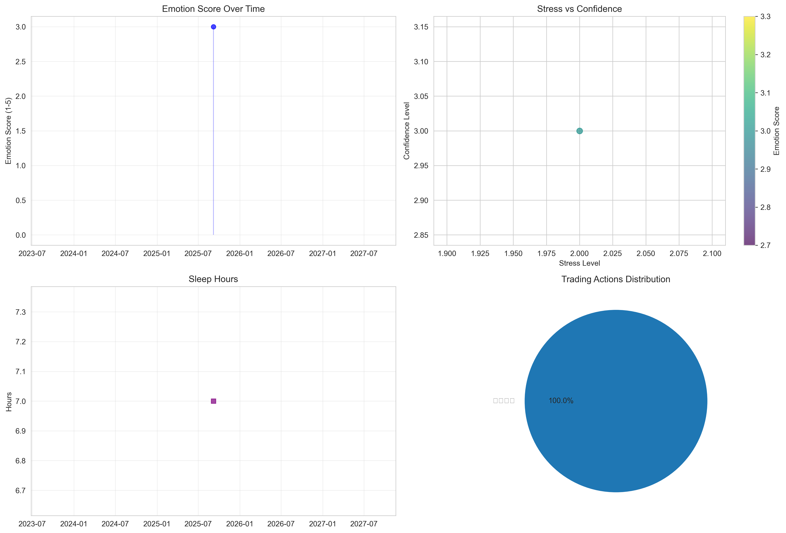

# 2025年9月 投資透明性レポート

> **完全開示主義** - すべての数字と感情を公開

## 📊 財務サマリー

| 指標 | 値 |
|------|-----|
| **月末資産評価額** | ¥1,000,000 |
| **月次実質リターン** | -100.0% |
| **純入出金** | ¥+1,000,000 |
| **累計総利益** | ¥+0 |
| **累計リターン率** | +0.0% |

## 🧠 メンタル分析

### 感情指標
- **平均感情スコア**: 3.0/5 😐
- **平均ストレスレベル**: 2.0/5 🙂  
- **平均自信レベル**: 3.0/5
- **平均睡眠時間**: 7.0時間
- **運動実施日数**: 1日

### 主要市場イベント
- 横ばい: 1回

### 主要取引行動
- ホールド: 1回

## 📈 チャート・可視化

## 🔍 振り返りと学び

### 今月のハイライト
- **最も成功した判断**: [手動記入]
- **最大の失敗**: [手動記入]
- **重要な気づき**: [手動記入]

### 来月の改善ルール
- [ ] [ルール1を記入]
- [ ] [ルール2を記入]  
- [ ] [ルール3を記入]

## ⚖️ 免責事項

この情報は個人的な投資記録であり、投資助言ではありません。すべての投資はリスクを伴います。

---
**生成日時**: 2025-09-06 10:00:30  
**データソース**: [GitHub Repository](https://github.com/tanisho1410/investment-disclosure-tools)
