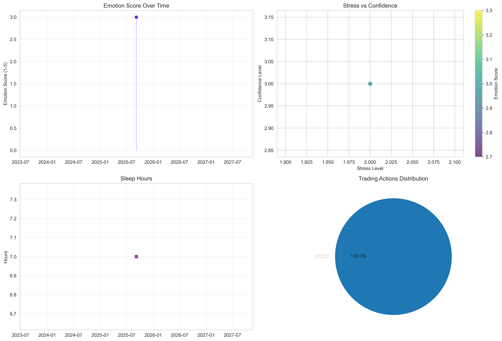

# {YEAR}年{MONTH}月 投資透明性レポート

> **完全開示主義** - すべての数字と感情を公開

## 📊 財務サマリー

| 指標 | 値 |
|------|-----|
| **月末資産評価額** | ¥{END_VALUE:,.0f} |
| **月次実質リターン** | {RETURN_RATE:+.1f}% |
| **純入出金** | ¥{NET_FLOW:+,.0f} |
| **累計総利益** | ¥{TOTAL_GAIN:+,.0f} |
| **累計リターン率** | {TOTAL_RETURN_RATE:+.1f}% |

## 🧠 メンタル分析

### 感情指標
- **平均感情スコア**: {AVG_EMOTION:.1f}/5 {EMOTION_EMOJI}
- **平均ストレスレベル**: {AVG_STRESS:.1f}/5 {STRESS_EMOJI}  
- **平均自信レベル**: {AVG_CONFIDENCE:.1f}/5
- **平均睡眠時間**: {AVG_SLEEP:.1f}時間
- **運動実施日数**: {EXERCISE_DAYS}日

### 主要市場イベント
{TOP_EVENTS}

### 主要取引行動  
{TOP_ACTIONS}

## 📈 チャート・可視化

## 🔍 振り返りと学び

### 今月のハイライト
- **最も成功した判断**: [手動記入]
- **最大の失敗**: [手動記入]
- **重要な気づき**: [手動記入]

### 来月の改善ルール
- [ ] [ルール1を記入]
- [ ] [ルール2を記入]  
- [ ] [ルール3を記入]

## ⚖️ 免責事項

この情報は個人的な投資記録であり、投資助言ではありません。すべての投資はリスクを伴います。

---
**生成日時**: {GENERATION_TIME}  
**データソース**: [GitHub Repository](https://github.com/tanisho1410/investment-disclosure-tools)